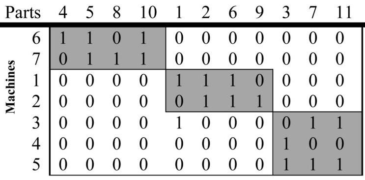

# A simulated annealing algorithm for manufacturing cell formation problem
  

## Structure of the repo
* [report](https://github.com/kislN/CellFormationProblem/blob/master/report.ipynb) with analysis of the SA algorithm with different parameters and demonstration of the results
* [implementation](https://github.com/kislN/CellFormationProblem/blob/master/algorithms/simulated_annealing.py) of the SA algorithm
* input and output [data](https://github.com/kislN/CellFormationProblem/tree/master/data)
* [tools](https://github.com/kislN/CellFormationProblem/tree/master/tools) for data loading, testing, comparing and other

## Obtained result

| case  | C  | T0 | Tf    | alpha | L  | D  | check | mean_time   | efficacy           |clusters |
|-------|----|----|-------|-------|----|----|-------|-------------|--------------------|---------|
| 20x20 | 2  | 50 | 0.002 | 0.9   | 10 | 6  | 4     | 0.66866863  | 0.4244604316546763 | 5       |
| 24x40 | 10 | 50 | 0.002 | 0.7   | 70 | 18 | 4     | 2.24271297  | 0.4563758389261745 | 11      |
| 30x50 | 2  | 10 | 0.002 | 0.8   | 10 | 6  | 4     | 3.83153903  | 0.4879227053140097 | 10      |
| 30x90 | 10 | 50 | 0.002 | 0.7   | 70 | 6  | 4     | 15.79377913 | 0.3994708994708995 | 11      |
| 37x53 | 2  | 30 | 0.002 | 0.7   | 70 | 6  | 4     | 0.7345016   | 0.6046511627906976 | 3       |

[Solutions](https://github.com/kislN/CellFormationProblem/tree/master/data/solutions)
